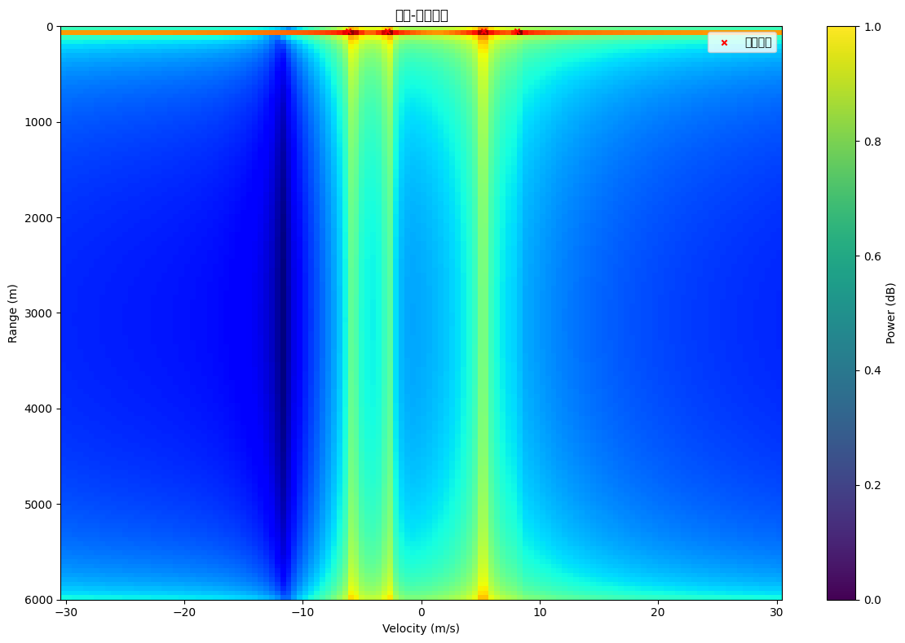
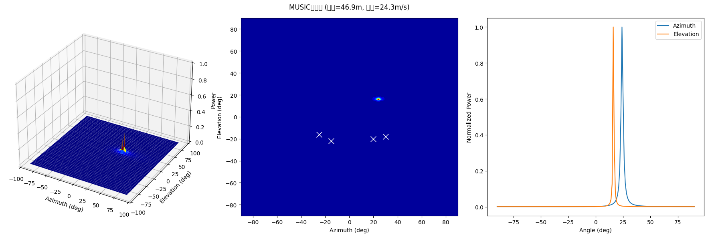
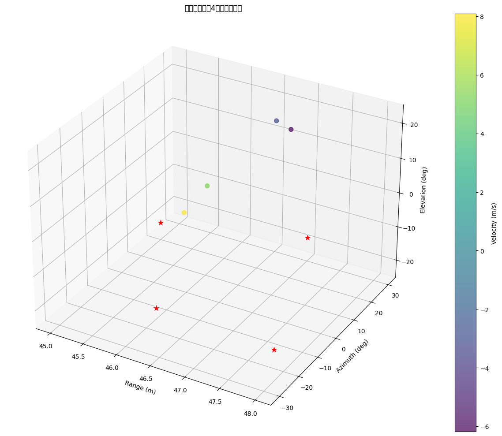
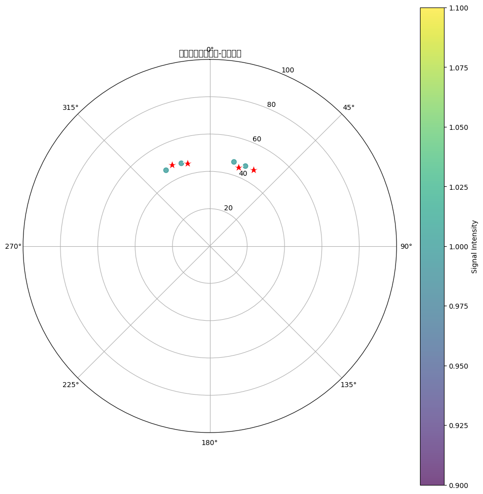
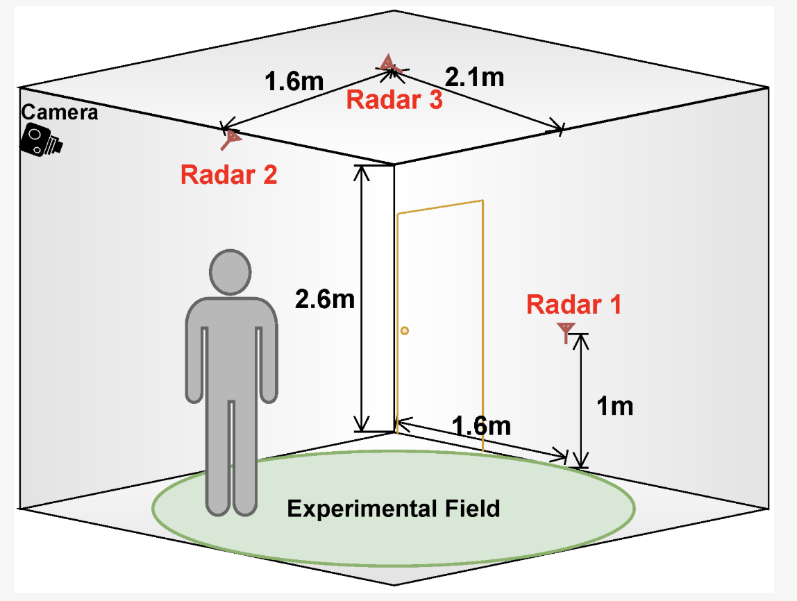

# 毫米波雷达手势识别系统

本项目基于毫米波雷达信号处理与深度学习，集成了经典信号处理算法（FFT、CFAR、MUSIC）与多种神经网络模型（含CBAM注意力机制、NonLocal模块、轻量化网络等），实现了多目标检测、角度估计与手势识别，并提供丰富的可视化分析。

## 目录结构
- `final version.py`：主流程代码，包含信号处理、特征提取、神经网络模型（含CBAM）等。
- `final_version_non_local.py`：集成NonLocal模块的改进版神经网络。
- `lightweighting.py`：轻量化网络实现与相关信号处理。
- `image/`：可视化结果图片（3D点云、热力图、MUSIC谱等）。
- `README.md`：项目说明文档。
- 其他：`adc_data.bin`（原始数据）、`bin_to_npy_converter.m`（数据转换脚本）、`non_local模块`、`可视化模块pro`（模块文件夹）。

## 安装依赖
建议使用Python 3.8+，主要依赖如下：
```bash
pip install numpy torch torchvision matplotlib scikit-learn tqdm seaborn scipy
```

## 快速开始
1. 数据准备：
   - 可使用`adc_data.bin`或自定义生成数据。
   - 支持直接调用`generate_moving_target_data`函数生成模拟目标。
2. 运行主流程：
   ```bash
   python final\ version.py
   ```
3. 查看可视化结果：
   - 结果图片保存在`image/`目录。
   - 支持3D点云、距离-多普勒热力图、MUSIC谱、极坐标等多种可视化。

## 主要功能模块
### 1. 信号处理
#### 1.1 距离-多普勒处理（FFT）
- 基于快速傅里叶变换（FFT）算法，提取目标的距离和速度信息，实现高效的距离-速度二维谱分析。
- 支持多目标分离，提升运动目标检测能力。
#### 1.2 CFAR自适应检测
- 采用恒虚警率（CFAR）算法，动态调整检测阈值，显著提升在复杂背景下的目标检测鲁棒性。
- 支持多种CFAR变体（如CA-CFAR、OS-CFAR等），适应不同场景需求。
#### 1.3 MUSIC高分辨率角度估计
- 利用MUSIC（Multiple Signal Classification）算法，实现对目标方位角和俯仰角的高精度估计。
- 具备多目标分辨能力，适用于密集目标环境。

### 2. 特征提取与建模
#### 2.1 RDAI多维特征融合
- 融合距离、速度、角度和信号强度等多维信息，生成丰富的热力图特征。
- 支持自定义特征组合，提升模型泛化能力。
#### 2.2 深度神经网络模型
- 集成多种神经网络结构，包括ResNet、CBAM注意力机制、NonLocal模块等。
- CBAM模块增强网络对关键区域的关注，NonLocal模块提升全局特征建模能力。
- 提供轻量化网络实现，适用于资源受限设备。
#### 2.3 手势识别与多目标分类
- 支持多类别手势识别，兼容多目标同时检测与分类。
- 可扩展至更多手势类别和复杂动作。

### 3. 可视化分析
#### 3.1 距离-多普勒热力图
- 直观展示目标在距离和速度维度的分布，便于运动特征分析。
#### 3.2 MUSIC谱三维曲面
- 展示角度估计结果，验证MUSIC算法性能。
#### 3.3 3D点云可视化
- 空间分布与速度信息一体化展示，支持多目标动态跟踪。
#### 3.4 极坐标视图
- 以极坐标方式展示目标方位与距离关系，辅助空间感知。

#### 示例图片





## 代码示例
```python
from final_version_non_local import GestureNet
import torch
model = GestureNet(num_classes=6)
input_tensor = torch.randn(1, 4, 64, 64)  # 假设输入为4通道64x64
output = model(input_tensor)
```

## 技术亮点与创新
- 多模态数据整合，提升检测与识别精度。
- 动态交互式可视化，支持多场景分析。
- 军事与民用场景兼容，适用性广泛。

## 为实现实时识别跌倒场景所作的尝试

目前所使用的AWR1843毫米波雷达板存在垂直方向识别灵敏度低以及距离分辨率低等硬件缺陷，而且难以顾及到整个三维场景。
经查阅资料后发现有两种较为可行的方案（一块IWR6843或者三块IWR1843），不过均需要在硬件上做出改变

### 使用IWR6843

参考论文：<https://www.mdpi.com/1424-8220/24/1/268>
以下是功能对比：

#### AWR1843 与 IWR6843 跌倒识别功能对比表

| **对比维度**         | **AWR1843**                                  | **IWR6843**                                  |
|----------------------|---------------------------------------------|---------------------------------------------|
| **工作频段**         | 76-81GHz（汽车雷达优化频段）                | 60-64GHz（人体检测优化频段）                |
| **目标适配性**       | 侧重远距离高速目标（如车辆）                | 侧重近距离人体细微动作（如跌倒姿态变化）    |
| **距离分辨率**       | 较低，难以区分人体细微距离变化              | 较高，精准捕捉站立/跌倒时的距离差异         |
| **角度分辨率**       | 较低，复杂场景下难辨个体姿态方向            | 较高，精准定位人体空间朝向及肢体角度关系    |
| **内置处理能力**     | 无，需外接设备处理原始数据                  | 集成信号处理、检测跟踪算法，支持本地实时分析|
| **数据输出形式**     | 仅输出原始ADC数据，需搭配DCA1000采集卡      | 直接输出处理后的点云数据（USB接口）        |
| **系统集成度**       | 需外接数据采集卡、算力主机（集成度低，设备多，不适用于日常生活的应用情景） | 单芯片方案，无需额外采集卡，可直接对接边缘计算设备（易于安装，便于直接应用于家居场景）|
| **实时性**           | 数据传输+外部处理延迟高，响应滞后           | 本地实时处理，延迟低，满足跌倒检测及时性需求|
| **多目标区分能力**   | 复杂场景下易受干扰，难以精准识别个体        | 高分辨率支持多人场景下的个体姿态独立检测    |
| **跌倒场景对比**         | ① 频段不适配人体细微动作特征提取<br>② 依赖外设导致系统复杂度过高<br>③ 实时性不足 | ① 频段更适合医疗场景<br>② 集成度高、响应快<br>③ 检测精度显著优于AWR1843 |

**表格说明**：  
1. **核心差异**：IWR6843 通过 **频段优化** 和 **高集成度** 直接解决了 AWR1843 在人体检测中的核心缺陷，尤其在 **实时性** 和 **精度** 上优势显著。    
2. **场景建议**：医疗级跌倒检测优先选择 IWR6843；若需复用汽车雷达硬件（AWR1843），需接受精度和实时性妥协。

### 使用三块IWR1843

参考论文：<https://www.mdpi.com/1424-8220/24/11/3660>
可使用三块IWR1843实现，以下为安装场景：


三块IWR1843协同使用具有以下优势：
#### 更广泛的检测范围与角度覆盖：
三个 IWR1843 雷达板可通过合理的布局，实现对大面积室内空间的全方位覆盖。例如在一个标准的两居室住宅中，将三个 IWR1843 分别安装在客厅、卧室和卫生间等关键位置，可确保对各个房间和主要活动区域无死角监测。而且通过调整雷达板的角度和位置，能够灵活地改变检测范围，有效减少因障碍物遮挡导致的检测盲区。在卫生间这样空间狭小但人员活动频繁且跌倒风险较高的区域，IWR1843 可针对性地进行安装，确保对该区域内人员活动状态的实时监测。​

#### 更高的数据分辨率与精度：
三个 IWR1843 协同工作时，可显著提升数据分辨率和精度。由于每个 IWR1843 都能独立采集数据，在处理跌倒识别任务时，多源数据相互补充和验证。通过先进的算法对这些数据进行融合处理，能够获取更精确的人体位置、速度和加速度等信息。在检测人体跌倒瞬间的快速动作变化时，高分辨率的数据可清晰捕捉到人体姿态的细微变化，从而更准确地区分跌倒与其他类似动作，大大提高了跌倒识别的准确率。​

#### 强大的多目标处理能力：
当面对多人环境时，三个 IWR1843 能够凭借各自独立的信号采集和处理能力，结合有效的数据融合与目标跟踪算法，对多个目标进行精准识别和跟踪。即使在人员密集、活动复杂的场景中，如养老院的公共活动室，每个 IWR1843 可分别负责监测不同区域内的人员，然后通过数据融合技术将各个雷达采集到的数据整合分析，准确区分不同个体，并实时监测每个个体的运动状态。这使得系统能够在复杂环境下准确判断出每个人员是否发生跌倒，极大地提高了多目标场景下跌倒识别的可靠性。

总结来说就是用数量来弥补精度以及检测范围的缺陷。


## 致谢
部分参数与数据参考自[DI-HGR/cross_domain_gesture_dataset](https://github.com/DI-HGR/cross_domain_gesture_dataset)。

## License
本项目仅供学术研究与交流，禁止商业用途。
